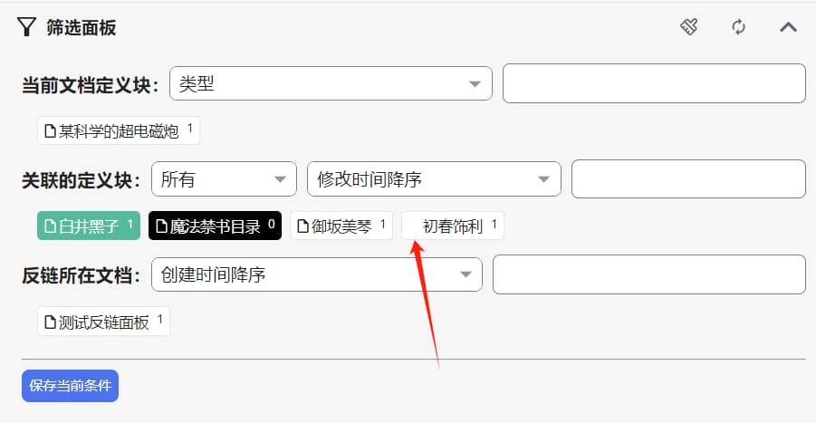
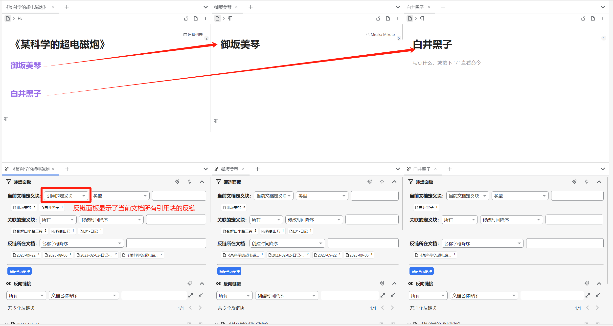
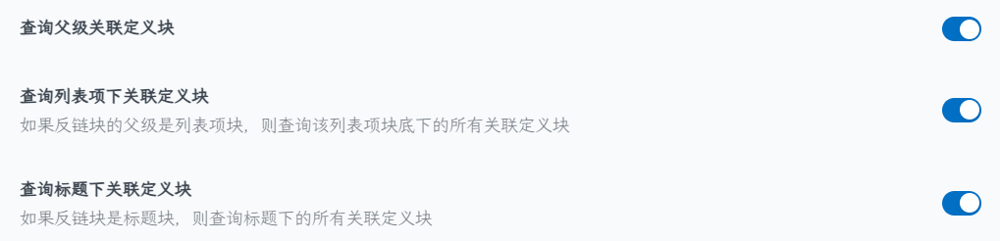
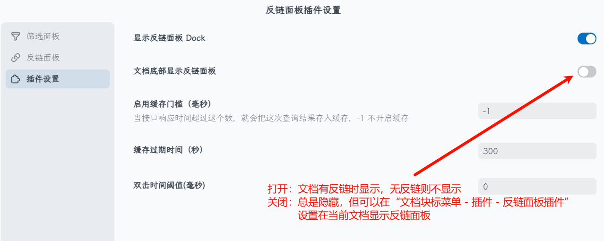

## 相关概念

本插件中涉及的概念如下：（例如块A引用了文档1的块B和文档2块C，现在进入块B所在文档1查看反链）

* 定义块：文档1中被引用的内容块，即块B
* 反链块：引用定义块的内容块，即块A
* 关联的定义块：反链块所在路径/父级路径/子级路径引用的其他文档的内容块，即块C

## 功能简述

*注：大部分功能都是“所见即所得”；根据本插件设置中的三项，依次对功能简述*

### （1）整体功能

本插件包括：

* 文档底部反链
* docker侧栏
* 页签分栏显示

前两个可在插件设置中调节是否显示，后一个的按钮在顶栏

### （2）筛选面板

* 筛选面板锚文本筛选状态解释：

  ​

  * 绿色：选定包含的定义块
  * 黑色：选定排除的定义块（右上角的的数字会一直是0，如果不为0说明出bug了）
  * 白色：待选中

  *注：如果定义块没有块标（图片中箭头所指块），说明该定义块所链接的块不存在（可能是被删除了）*
* 筛选面板对锚文本的操作：

  * 电脑端：

    * 包含：左键点击锚文本
    * 排除：<kbd>Shift + click</kbd>​、右击、双击（需要先设置双击间隔）
  * 手机端：

    * 包含：单击锚文本
    * 排除：长按锚文本
* 正如其名，“当前文档定义块”和“关联的定义块”**显示的其实都是定义块的文本内容**，而非双链自身的锚文本内容
* `当前文档定义块`​：用于汇总查询分布在不同文档定义块的反链，分为如下几种：

  1. `当前文档定义块`​：本文档被引用的内容块
  2. `引用其他文档的定义块`​：在文档中引用其他块，选择此项就可以查看引用的所有定义块它们的反链

      ​
* `关联的定义块`​：`当前文档定义块`​对应反链内容中引用其他文档的内容块

  * 可在设置中选择关联的定义块的范围：

    *解释：如果在插件设置中启用*​*​`查询父级关联定义块`​*​ *，那么反链面板中反链块的上级路径中的所有引用的定义块也会出现在筛选面板*

    
  * 可筛选“静态锚文本”和“动态锚文本”。鼠标悬浮在静态锚文本上**会同时显示锚文本和定义块的文本内容**
  * 这里的搜索功能**既可以搜索双链锚文本，也可以搜索双链引用的内容**
* `反链所在文档`​：

  排序和筛选反链块所在的文档块。目前同时只能选中一个文档，不支持多个

### （3）反链面板

*注：这里所说的反链面板是指显示反链块的区域*

* 本插件此处的展示逻辑与官方不一样：官方是以含有反链块的文档分组排序；本插件以反链块为单位展示和排序
* 插件设置中关于底部反链的显示：

  ​

  除了这个总设置外，可在特定文档中设置是否显示底部反链。点击`文档块标 - 插件 - 反链筛选面板`​快捷选择，本质是通过添加自定义属性「document-bottom-show-backlink-filter-panel」选择特定文档是否显示底部反链区域：

  1. `恢复默认`​：删除自定义属性「document-bottom-show-backlink-filter-panel」，该文档是否显示底部反链与插件设置保持一致
  2. `始终显示文档底部反链`​：添加自定义属性「document-bottom-show-backlink-filter-panel」，值为1，无论插件设置如何，该文档都显示底部反链
  3. `始终隐藏文档底部反链`​：添加自定义属性「document-bottom-show-backlink-filter-panel」，值为-1，无论插件设置如何，该文档都隐藏底部反链

* 反链面板的搜索功能：

  * 已支持搜索文档名，可以同时搜索文档名+反链块中的关键词

    
  * 搜索框支持一些搜索语法： `%`​匹配锚文本内容，`-`​排除内容， `-%`​ 或`%-`​排除锚文本内容。 可以混合使用

    |筛选语法前缀|内容|锚文本内容|
    | --------------| --------| ------------|
    |筛选|无前缀|​`%`​|
    |包含|空格|空格|
    |排除|​`-`​|​`%-`​ 或 `-%`​|

    *注：此处所说的“内容”是指反链块所有的文本内容（包括反链块所在的文档名称）；而“锚文本内容”仅指反链块中用作块引用锚文本的文本内容（无论静态还是动态锚文本）。因此“内容”是包含“锚文本内容”的*
  * 反链面板在搜索关键词时，筛选面板中的各项可筛选范围也会相应改变
* <kbd>Ctrl + click</kbd>​ 反链区域的文档名/面包屑可以跳转到指定文档，这与官方反链面板逻辑一致

### （4）其他技巧

* 定义块的时间排序是根据定义块所在的反链块时间进行排序
* 已支持「保存当前条件」，保存的是包含筛选面板和反链面板的所有条件
* 开启本插件设置的`筛选面板 - 默认选中查看块`​，筛选面板会默认选中文档块，实现类似于思源设置中取消“反向链接包含子块”的效果：

  ​

