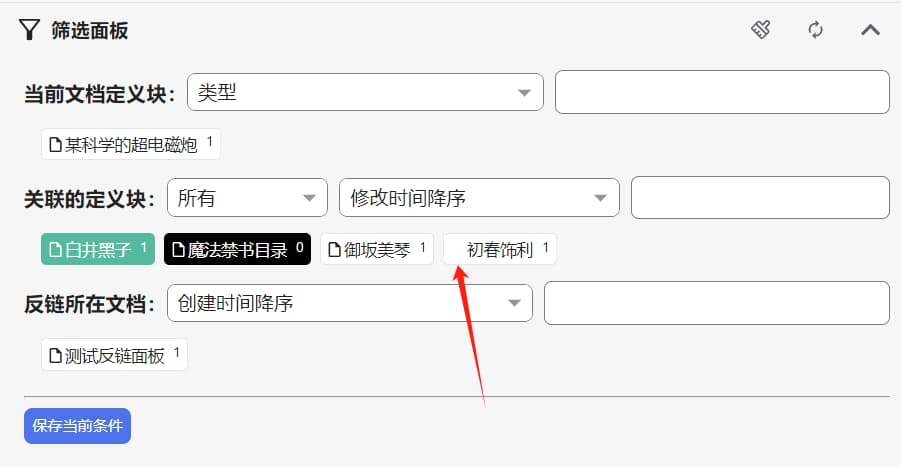

## 反链筛选面板

### 注意

如果反链面板响应太慢，建议使用思源v3.1.4版本及以后，安装新版思源后需要重建索引。

### 特性

* 侧边栏（Dock）显示
* 文档底部显示
* 页签分栏显示

### 功能介绍

#### 筛选面板

* 定义块的操作
  * 包含定义块：单击
  * 排除定义块：Shift + 单击、右击、双击（需要设置双击时间阈值）
* 定义块的状态
  * 
  * 绿色：必须包含的定义块
  * 黑色：排除的定义块（右上角的的数字会一直是0，如果不为0说明出bug了）
  * 如果定义块没有块标（图片中箭头所指块），说明该定义块所链接的块不存在（可能是被删除了）。
* 定义块时间排序
  * 是根据定义块所在的反链块时间进行排序。
* 保存当前条件
  * 会保存包含筛选面板和反链面板的所有条件。

#### 反链面板

本插件的展示逻辑与官方不一样了，官方是以含有反链块的文档分组排序；本插件以反链块为单位展示和排序。

